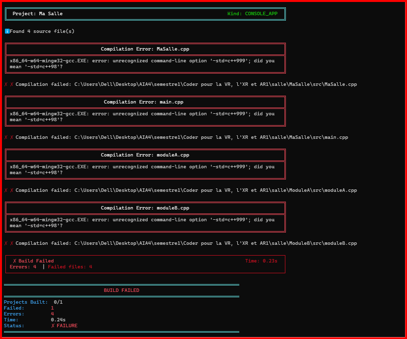
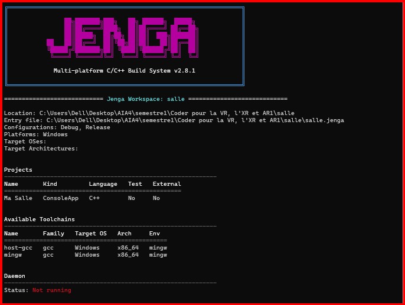

# Demo1

## 1. Erreur volontaire

Une erreur volontaire a été introduite dans le fichier `salle.jenga`.

La configuration correcte était :

```python
cppdialect("C++17")
```

Elle a été volontairement remplacée par :

```python
cppdialect("C++999")
```

`C++999` n'est pas un standard C++ reconnu par le compilateur utilisé par le projet.

## 2. Résultat de `jenga build`

La commande :

```bash
jenga build
```

charge correctement le workspace, mais la compilation échoue.

L'erreur importante affichée par le compilateur est :



Cette sortie permet donc d'identifier concrètement la cause de l'échec : la valeur `C++999` génère l'option `-std=c++999`, qui n'est pas reconnue par GCC.

## 3. Résultat de `jenga info`

La commande :

```bash
jenga info
```

réussit à charger et analyser le workspace.

Elle affiche notamment :




Cependant, `jenga info` ne signale pas `C++999` comme une erreur de compilation.

## 4. Comparaison

Les deux commandes n'ont donc pas le même rôle.

`jenga info` permet d'analyser et de présenter la configuration générale du workspace et des projets.

`jenga build` utilise cette configuration pour effectuer réellement la construction. Il permet donc de révéler l'erreur provoquée par la configuration lorsqu'elle est transmise au compilateur.

## 5. Conclusion

Dans cette expérience, c'est la sortie de `jenga build` qui permet de désigner la cause concrète de l'échec.

Le message :

```text
unrecognized command-line option '-std=c++999'
```

montre que la configuration `cppdialect("C++999")` entraîne une option de compilation invalide.

Cette expérience montre ainsi la différence entre l'analyse de la configuration d'un projet et l'erreur qui apparaît lorsque cette configuration est effectivement utilisée pendant la construction.
