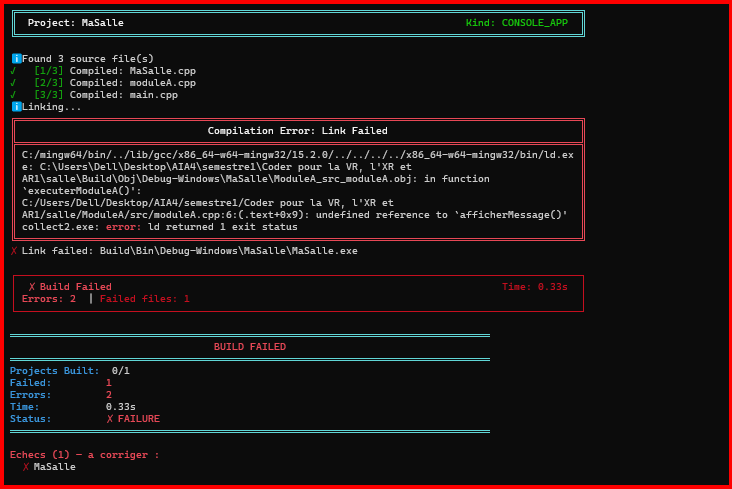

# Demo2

## 1. Manipulation effectuée

Une dépendance a été volontairement retirée du fichier de projet.

Le fichier `ModuleB/src/moduleB.cpp` n'a pas été inclus dans la compilation, alors que `ModuleA/src/moduleA.cpp` utilise la fonction `afficherMessage()` fournie par le module B.

Le projet a donc été construit avec seulement trois fichiers sources :

* `MaSalle.cpp`
* `moduleA.cpp`
* `main.cpp`

## 2. Résultat de la construction

La compilation des trois fichiers réussit, mais l'erreur apparaît au moment de l'édition de liens.

Le passage important de la sortie est :



## 3. Recherche de la cause

L'information importante à rechercher dans le mur de texte est :

```text
undefined reference to `afficherMessage()'
```

Cette ligne signifie que l'éditeur de liens ne trouve pas la définition de la fonction `afficherMessage()`.

La sortie indique également que l'appel provient de :

```text
ModuleA/src/moduleA.cpp:6
```

En examinant les dépendances du projet, on constate que `moduleA.cpp` inclut `moduleB.hpp` et utilise la fonction `afficherMessage()`.

Or, `moduleB.cpp`, qui contient la définition de cette fonction, a volontairement été retiré de la construction.

## 4. Conclusion

Cette expérience montre la différence entre une erreur de compilation et une erreur d'édition de liens.

Les fichiers restants sont correctement compilés, mais lors de l'étape de linkage, l'éditeur de liens ne trouve pas la définition de `afficherMessage()`.

L'information qui désigne le symbole manquant est donc :

```text
undefined reference to `afficherMessage()'
```

Le module manquant est `ModuleB`.
