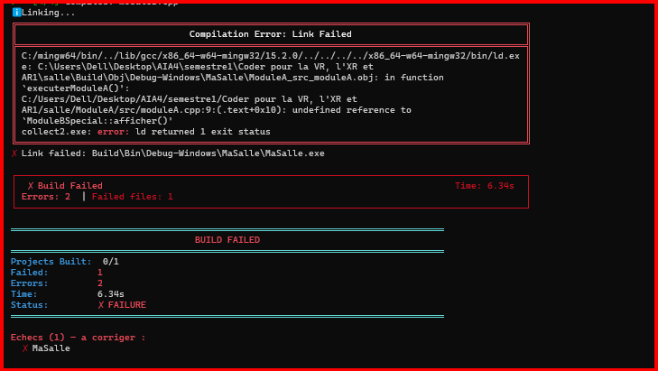

## Demo 3

Le même fichier d'en-tête `moduleB.hpp` a été compilé deux fois : une première fois sans la définition `MODULE_B_SPECIAL` et une seconde fois avec cette définition. Sans le `#define`, le préprocesseur conserve la déclaration `class ModuleB`, tandis qu'avec le `#define`, il conserve la déclaration `class ModuleBSpecial`. Le même en-tête ne produit donc pas la même déclaration selon le contexte de compilation.

Cette différence ne provoque pas immédiatement une erreur de compilation, car chaque fichier source est compilé séparément. `moduleA.cpp`, compilé avec `MODULE_B_SPECIAL`, utilise `ModuleBSpecial::afficher()`, tandis que `moduleB.cpp`, compilé sans cette définition, fournit `ModuleB::afficher()`. Les deux fichiers sont donc individuellement cohérents et sont tous les deux compilés avec succès.

L'erreur apparaît ensuite lors de l'édition de liens. Le fichier objet issu de `moduleA.cpp` demande le symbole `ModuleBSpecial::afficher()`, mais le fichier objet issu de `moduleB.cpp` fournit `ModuleB::afficher()`. Ces deux symboles étant différents, le lieur ne trouve pas la définition correspondant à la référence demandée et signale :

`undefined reference to 'ModuleBSpecial::afficher()'`

Cette expérience montre donc que le compilateur vérifie principalement chaque unité de traduction séparément, alors que le lieur est chargé de résoudre les références entre les différents fichiers objets. C'est pourquoi l'erreur est signalée au moment de l'édition de liens et non pendant la compilation.
