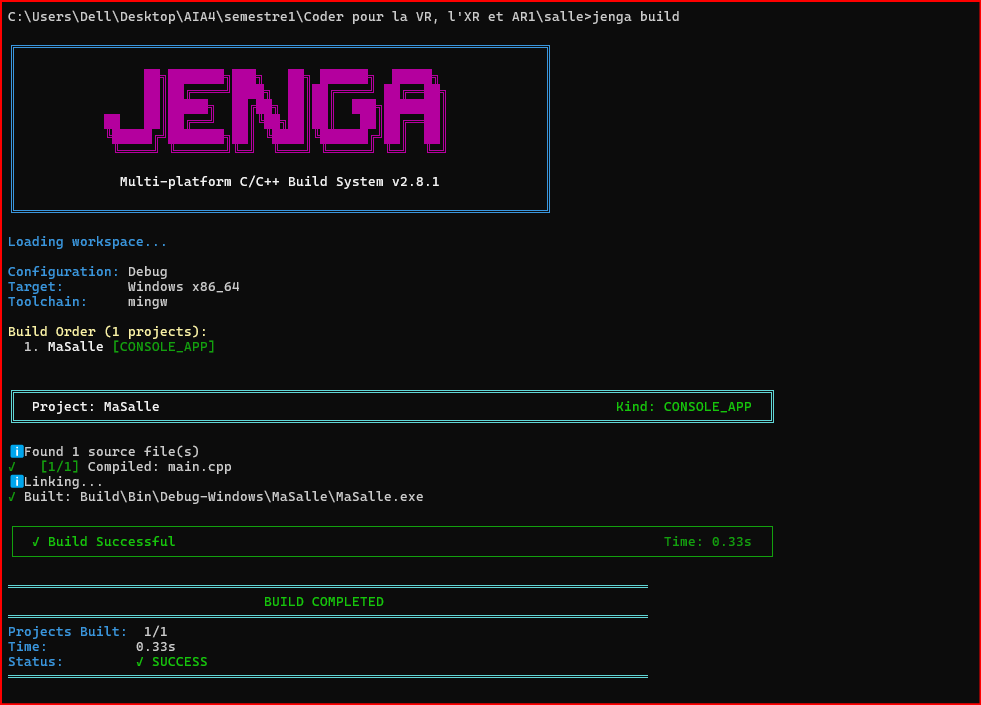

# Exercice 1 — Le projet minimal

## Objectif

L'objectif de cet exercice est de créer un projet minimal avec Jenga et de vérifier que celui-ci peut être correctement construit.

## Structure du projet

Le projet contient :

- un fichier de projet Jenga ;
- un fichier [Voir le fichier `main.cpp`](main.cpp) contenant le programme principal ;
- [Voir le fichier de projet Jenga](salle.jenga) ;
- La sortie du terminale : 
- ce fichier `README.md`.

## Programme C++

Le programme ne réalise aucune opération particulière. Il contient simplement une fonction `main` qui retourne zéro :

```cpp
int main()
{
    return 0;
}