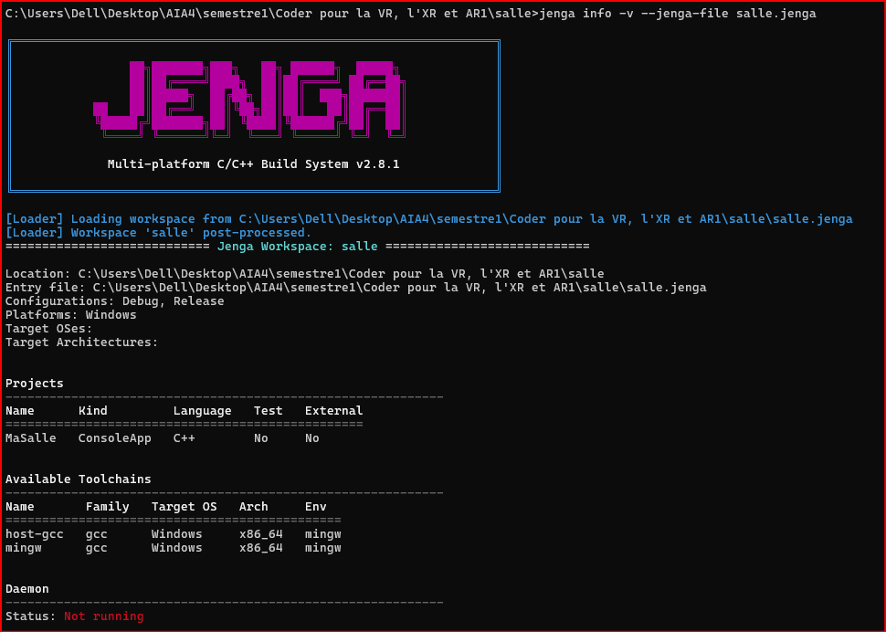

# Exercice14
## Objectif

L'objectif de cet exercice est d'ajouter à un projet Jenga un filtre conditionnel destiné à la plateforme Android.

Ce filtre doit :

* définir les macros `ANDROID` et `__ANDROID__` ;
* ajouter les bibliothèques Android `log`, `android` et `GLESv3`.

---

## 1. Ajout du filtre Android

Le filtre a été ajouté dans le projet `MaSalle` du fichier `salle.jenga` :

```python
from Jenga import *

with workspace("salle"):

    with project("MaSalle"):
        consoleapp()
        language("C++")
        cppdialect("C++17")
        location(".")

        files([
            "src/**.cpp",
            "include/**.hpp"
        ])

        with filter("system:Android"):
            defines([
                "ANDROID",
                "__ANDROID__"
            ])

            links([
                "log",
                "android",
                "GLESv3"
            ])
```

Le filtre est placé à l'intérieur du bloc `project("MaSalle")`, car les fonctions `defines()` et `links()` doivent être associées à un projet ou à une toolchain.

---

## 2. Vérification avec `jenga info`

La commande suivante a été exécutée :

```bash
jenga info -v --jenga-file salle.jenga
```

La commande fonctionne correctement et affiche notamment :



Cependant, aucune information concernant directement les définitions :

```text
ANDROID
__ANDROID__
```

ou les bibliothèques :

```text
log
android
GLESv3
```

n'apparaît dans cette sortie.

Ainsi, `jenga info` ne permet pas de constater directement si le filtre conditionnel Android est activé ou non.

---


## 3. Vérification avec une commande prenant `--platform`

La commande d'aide de Jenga a été consultée avec :

```bash
jenga gen --help
```

Elle indique que la commande `jenga gen` accepte l'option :

```text
--platform PLATFORM
    Context platform for filters (e.g. Windows-x86_64)
```

Cette option permet donc de fournir explicitement un contexte de plateforme lors de la génération.

La vérification du filtre Android se ferait ainsi avec la forme générale :

```bash
jenga gen --platform <plateforme-Android> --jenga-file salle.jenga
```

Cette commande permet de tester le projet dans le contexte de la plateforme Android et donc de vérifier que le filtre :

```python
with filter("system:Android"):
```

est bien pris en compte.

---

## Conclusion

L'exercice montre que `jenga info` ne permet pas de vérifier directement l'activation d'un filtre conditionnel. Il affiche les informations générales du workspace, mais pas les effets des `defines()` et `links()` contenus dans le filtre.

Pour vérifier réellement le comportement du filtre Android, il faut utiliser une commande qui accepte un contexte de plateforme avec l'option `--platform`, comme `jenga gen`.

Le filtre Android ajouté au projet contient les définitions :

```text
ANDROID
__ANDROID__
```

et les bibliothèques :

```text
log
android
GLESv3
```
