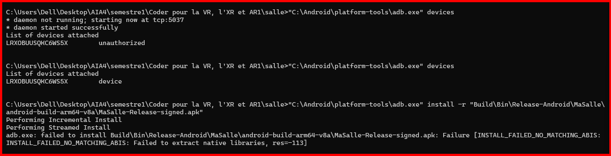

# Exercice17

Après la génération et la signature du paquet `MaSalle-Release-signed.apk`, nous avons tenté de l'installer sur un appareil Android réel connecté au PC par USB.

L'appareil a été correctement détecté et autorisé par ADB :

```text
List of devices attached
LRXOBUUSQKC6WS5X    device
```

L'installation a ensuite été effectuée avec la commande :

```bat
adb install -r "Build\Bin\Release-Android\MaSalle\android-build-arm64-v8a\MaSalle-Release-signed.apk"
```

L'installation a échoué avec le message exact suivant :

```text
Failure [INSTALL_FAILED_NO_MATCHING_ABIS: INSTALL_FAILED_NO_MATCHING_ABIS: Failed to extract native libraries, res=-113]
```

Le paquet contient une bibliothèque native compilée pour l'architecture `arm64-v8a` :

```text
lib/arm64-v8a/libMaSalle.so
```

L'erreur `INSTALL_FAILED_NO_MATCHING_ABIS` indique qu'aucune ABI native compatible avec cette bibliothèque n'a été trouvée sur l'appareil lors de l'installation.

Conformément à l'énoncé, le message exact de l'échec d'installation est conservé comme résultat de l'expérience.


