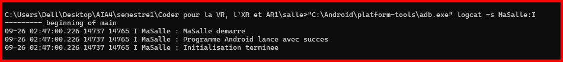

# Exercice18

## 1. Objectif

L’objectif de cet exercice est de faire afficher **trois lignes au démarrage de l’application Android**, puis de vérifier leur présence dans le **journal système Android**.


---

## 2. Messages affichés par le programme

Au démarrage de l’application, trois messages sont envoyés au journal Android avec le tag :

```text
MaSalle
```

Les trois lignes sont :

```text
MaSalle demarre
Programme Android lance avec succes
Initialisation terminee
```

Le code utilisé pour écrire ces messages dans le journal système est :

```cpp
__android_log_print(ANDROID_LOG_INFO, LOG_TAG,
                    "MaSalle demarre");

__android_log_print(ANDROID_LOG_INFO, LOG_TAG,
                    "Programme Android lance avec succes");

__android_log_print(ANDROID_LOG_INFO, LOG_TAG,
                    "Initialisation terminee");
```

Le tag utilisé est :

```cpp
#define LOG_TAG "MaSalle"
```

Ainsi, les trois messages peuvent être facilement retrouvés dans `logcat`.

---

## 3. Lancement de l'application

Après avoir construit et installé l'APK sur l'appareil Android, l'application est lancée avec la commande :

```bat
"C:\Android\platform-tools\adb.exe" shell monkey -p com.salle.masalle 1
```

Cette commande demande à Android de lancer l'application dont le package est :

```text
com.salle.masalle
```

---

## 4. Lecture du journal système

Android fournit les messages système avec l'outil `logcat`.

Sans filtrage, le journal contient un très grand nombre de messages provenant du système et des différentes applications.

Pour ne voir que les messages produits par notre programme, nous avons utilisé le **tag `MaSalle`**.

### Commande de filtrage utilisée

```bat
"C:\Android\platform-tools\adb.exe" logcat -s MaSalle:I
```

### Explication

* `adb` : outil permettant de communiquer avec l'appareil Android ;
* `logcat` : affiche le journal système Android ;
* `-s` : permet de filtrer les messages selon un tag ;
* `MaSalle` : tag utilisé par notre programme ;
* `:I` : affiche les messages de niveau **Info** et les niveaux plus importants.

Cette commande permet donc de ne voir que les messages associés au tag `MaSalle`, au lieu d'afficher tout le journal système.

---

## 5. Résultat obtenu

Après le lancement de l'application et l'exécution de la commande de filtrage, les trois messages apparaissent dans le journal :

```text
--------- beginning of main
09-26 02:47:00.226 14737 14765 I MaSalle : MaSalle demarre
09-26 02:47:00.226 14737 14765 I MaSalle : Programme Android lance avec succes
09-26 02:47:00.226 14737 14765 I MaSalle : Initialisation terminee
```

On retrouve bien les **trois lignes demandées** :

```text
MaSalle demarre
Programme Android lance avec succes
Initialisation terminee
```

Le tag `MaSalle` permet de distinguer les messages de notre programme au milieu des autres messages du journal Android.

---

## 6. Correspondance avec l'énoncé

L'énoncé demande :

> Faites afficher trois lignes par votre programme au démarrage, puis lisez-les dans le journal du système.

**Réalisation :**

Les trois lignes sont générées au démarrage de l'application :



**Commande fournie :**

```bat
"C:\Android\platform-tools\adb.exe" logcat -s MaSalle:I
```

Le filtrage par le tag `MaSalle` permet de ne conserver que les messages générés par notre programme.

---

## 7. Conclusion

L'exercice a été réalisé avec succès.

Au démarrage de l'application Android, trois messages sont générés par le programme. Ils sont ensuite retrouvés dans le journal système grâce à `adb logcat`.

La commande de filtrage utilisée est :

```bat
"C:\Android\platform-tools\adb.exe" logcat -s MaSalle:I
```

Elle permet d'isoler les messages de notre application au milieu de l'ensemble des messages produits par le système Android.

**Résultat : les trois lignes demandées sont correctement affichées et lisibles dans le journal système.**
