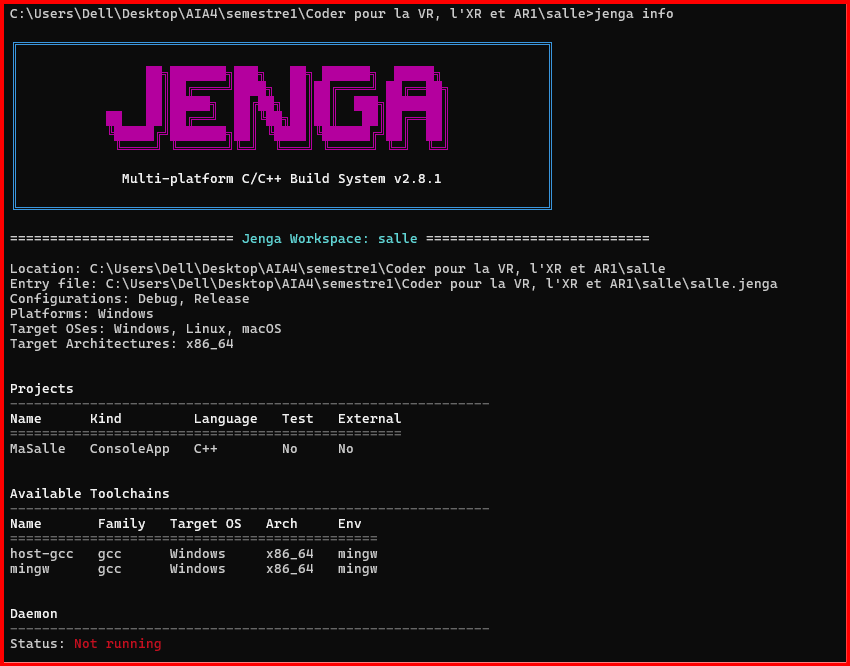

## Exercice — `jenga info`

### Objectif

L'objectif est d'observer les informations que Jenga déduit du fichier de projet.

### Commande exécutée

```bash
jenga info
```

## Sortie de `jenga info`

- La sortie du terminale : 

## Explication de la sortie de la commande `jenga info`

La commande `jenga info` permet de voir comment Jenga a interprété le fichier de projet `salle.jenga`. Elle indique notamment le nom du workspace (`salle`), son emplacement, le fichier d'entrée utilisé, les configurations disponibles (`Debug` et `Release`), les systèmes d'exploitation ciblés et l'architecture x86_64.

Elle permet également de voir que Jenga a reconnu un projet nommé `MaSalle`, de type `ConsoleApp`, écrit en C++, sans tests et sans dépendance externe. La commande affiche aussi les toolchains disponibles (`host-gcc` et `mingw`) ainsi que leur environnement. Enfin, elle indique l'état du daemon Jenga, qui est ici arrêté.

Ainsi, contrairement au fichier de projet qui contient les déclarations écrites pour configurer le projet, `jenga info` montre la configuration résultante telle que Jenga l'a comprise, ainsi que certaines informations sur l'environnement de construction.