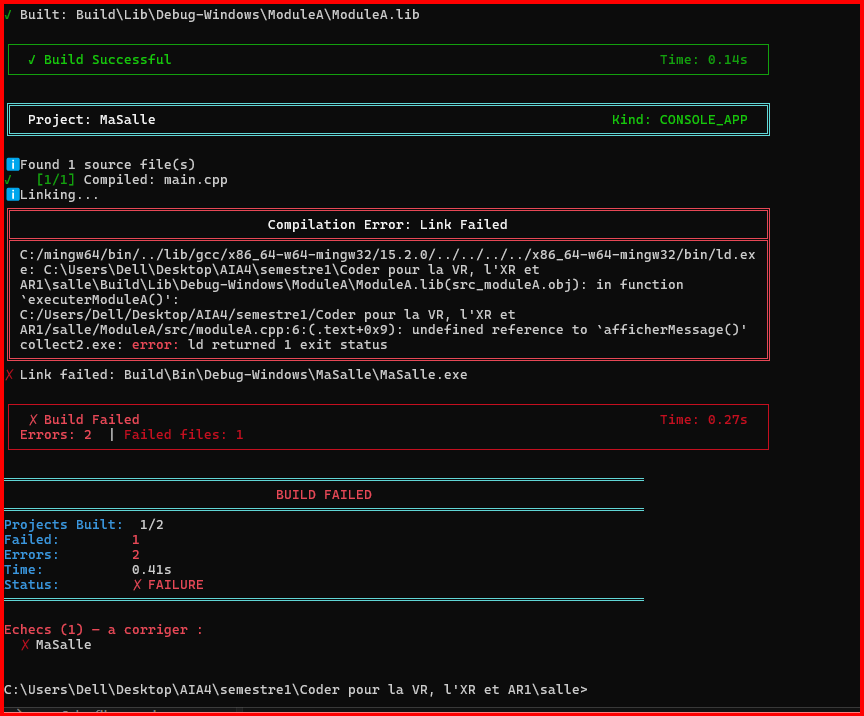

# Exercice4 : la dépendance retiree

## 1. Objectif

L'objectif de cette manipulation est d'ajouter plusieurs modules C++ dans un workspace Jenga, de créer une dépendance entre deux modules, puis de retirer le module dont dépend le premier afin d'observer l'erreur générée par le système de construction.

La chaîne de dépendances mise en place est la suivante :

```text
MaSalle
   │
   ▼
ModuleA
   │
   ▼
ModuleB
```

Ainsi :

* `MaSalle` dépend de `ModuleA`.
* `ModuleA` dépend de `ModuleB`.
* `ModuleB` contient la fonction `afficherMessage()`.
* `ModuleA` utilise cette fonction.
* `MaSalle` appelle `executerModuleA()`.

---

## 2. Organisation du projet

Le workspace est organisé comme suit :

```text
salle/
│
├── salle.jenga
│
├── MaSalle/
│   └── src/
│       └── main.cpp
│
├── ModuleA/
│   ├── include/
│   │   └── moduleA.hpp
│   └── src/
│       └── moduleA.cpp
│
└── ModuleB/
    ├── include/
    │   └── moduleB.hpp
    └── src/
        └── moduleB.cpp
```

---

## 3. Fonctionnement des modules

### ModuleB

`ModuleB` contient la fonction :

```cpp
void afficherMessage();
```

Sa définition est :

```cpp
void afficherMessage()
{
    std::cout << "Message du ModuleB" << std::endl;
}
```

Cette fonction est donc réellement implémentée dans `ModuleB`.

### ModuleA

`ModuleA` contient la fonction :

```cpp
void executerModuleA();
```

Cette fonction appelle :

```cpp
afficherMessage();
```

Il existe donc une dépendance directe :

```text
ModuleA → ModuleB
```

Dans `salle.jenga`, cette dépendance est déclarée avec :

```python
dependson(["ModuleB"])
```

### MaSalle

Le programme principal appelle :

```cpp
executerModuleA();
```

MaSalle dépend donc de ModuleA :

```python
dependson(["ModuleA"])
```

La chaîne complète est ainsi :

```text
MaSalle → ModuleA → ModuleB
```

---

## 4. Première construction avec les trois modules

Lorsque les trois projets sont présents, Jenga détecte correctement l'ordre de construction :

```text
Build Order (3 projects):
  1. ModuleB [STATIC_LIB]
  2. ModuleA [STATIC_LIB] (depends: ModuleB)
  3. MaSalle [CONSOLE_APP] (depends: ModuleA)
```

`ModuleB` est compilé et sa bibliothèque est créée :

```text
Build\Lib\Debug-Windows\ModuleB\ModuleB.lib
```

Puis `ModuleA` est compilé :

```text
Build\Lib\Debug-Windows\ModuleA\ModuleA.lib
```

Enfin, Jenga tente de construire l'application `MaSalle`.

Cette étape permet de vérifier que les modules et leurs dépendances sont bien reconnus par Jenga.

---

## 5. Retrait de ModuleB

Pour réaliser l'expérience demandée, `ModuleB` est retiré de la liste des projets dans `salle.jenga`.

Cependant, la dépendance suivante est volontairement conservée dans `ModuleA` :

```python
dependson(["ModuleB"])
```

La situation devient donc :

```text
MaSalle
   │
   ▼
ModuleA
   │
   ▼
ModuleB
   ✗
```

`ModuleB` n'est plus construit, mais `ModuleA` utilise toujours la fonction :

```cpp
afficherMessage();
```

---

## 6. Résultat de la construction

Après avoir retiré `ModuleB`, Jenga construit :

```text
Build Order (2 projects):
  1. ModuleA [STATIC_LIB]
  2. MaSalle [CONSOLE_APP] (depends: ModuleA)
```

`ModuleA` est compilé correctement.

`MaSalle` est également compilé correctement.

L'échec apparaît ensuite pendant l'étape de liaison :

```text
ℹ Linking...
```

Le message d'erreur obtenu est :


Jenga indique ensuite :

```text
✗ Link failed: Build\Bin\Debug-Windows\MaSalle\MaSalle.exe
```

et :

```text
Build Failed
```

---

## 7. Interprétation de l'erreur

L'erreur principale est :

```text
undefined reference to `afficherMessage()'
```

Cela signifie que le compilateur connaît l'existence de la fonction `afficherMessage()`, mais que l'éditeur de liens ne trouve pas son implémentation au moment de construire l'exécutable final.

La fonction est définie dans :

```text
ModuleB/src/moduleB.cpp
```

mais `ModuleB` a été retiré de la liste des projets.

Sa bibliothèque :

```text
ModuleB.lib
```

n'est donc plus disponible pour résoudre la référence à :

```cpp
afficherMessage();
```

présente dans `ModuleA`.

---

## 8. Étape de la chaîne de construction concernée

L'erreur appartient à **l'édition de liens** (*linking*).

La chaîne de construction simplifiée est :

```text
Préprocesseur
      ↓
Compilation
      ↓
Assemblage
      ↓
Édition de liens
```

Dans notre expérience :

* Le préprocesseur fonctionne.
* La compilation de `moduleA.cpp` fonctionne.
* La compilation de `main.cpp` fonctionne.
* L'assemblage est effectué.
* **L'édition de liens échoue.**

La présence de :

```text
ld.exe
```

et de :

```text
undefined reference to `afficherMessage()'
```

confirme qu'il s'agit d'une erreur du linker.

---

## 9. Conclusion

Cette expérience montre l'importance des dépendances entre modules dans un système de construction.

`ModuleA` utilise une fonction définie dans `ModuleB`. Lorsque `ModuleB` est présent, la dépendance peut être prise en compte dans la construction. Lorsque `ModuleB` est retiré alors que `ModuleA` continue de l'utiliser, l'édition de liens ne peut pas résoudre la référence à `afficherMessage()`.

L'erreur obtenue est donc :

```text
undefined reference to `afficherMessage()'
```

et elle appartient à l'étape :

```text
ÉDITION DE LIENS
```

Le résultat final est :

```text
ModuleA → ModuleB absent
        ↓
Référence à afficherMessage() non résolue
        ↓
Échec de l'édition de liens
        ↓
Build Failed
```
