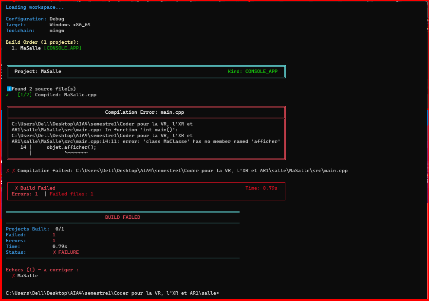

# Exercice5 

## 1. Objectif

L'objectif de cet exercice est de comprendre l'utilisation des **directives du préprocesseur C++** avec un `define`.

Nous avons créé un en-tête `MaClasse.hpp` qui possède deux comportements :

* lorsque `MA_CLASSE_COMPLETE` est défini, la classe `MaClasse` possède un constructeur et une méthode `afficher()` ;
* lorsque `MA_CLASSE_COMPLETE` n'est pas défini, `MaClasse` devient une classe vide.

Le même programme est ensuite compilé :

1. avec le `define` ;
2. sans le `define`.

---

## 2. Structure du projet

```text
salle/
│
├── salle.jenga
│
└── MaSalle/
    │
    ├── include/
    │   └── MaClasse.hpp
    │
    └── src/
        ├── MaClasse.cpp
        └── main.cpp
```

---

## 3. Fichiers du projet

### `MaClasse.hpp`

Le fichier `MaClasse.hpp` contient une condition `#ifdef`.

Lorsque `MA_CLASSE_COMPLETE` est défini, la classe possède la méthode `afficher()`.

Sinon, une classe vide est déclarée.

```cpp
#pragma once

#ifdef MA_CLASSE_COMPLETE

class MaClasse
{
public:
    MaClasse();
    void afficher();
};

#else

class MaClasse
{
};

#endif
```

**Lien du fichier :**

[Voir le fichier `MaClasse.hpp`](MaClasse.hpp)

---

### `MaClasse.cpp`

Ce fichier implémente la classe uniquement lorsque le `define` est présent.

```cpp
#include "../include/MaClasse.hpp"

#ifdef MA_CLASSE_COMPLETE

#include <iostream>

MaClasse::MaClasse()
{
}

void MaClasse::afficher()
{
    std::cout << "Classe complète" << std::endl;
}

#endif
```

**Lien du fichier :**

[Voir le fichier `MaClasse.cpp`](MaClasse.cpp)

---

### `main.cpp`

Le programme crée un objet `MaClasse` puis appelle sa méthode `afficher()`.

```cpp
#include <iostream>

#include "../include/MaClasse.hpp"

int main()
{
    MaClasse objet;
    objet.afficher();

    return 0;
}
```

**Lien du fichier :**

[Voir le fichier `main.cpp`](main.cpp)

---

## 4. Configuration Jenga

Le projet est déclaré dans `salle.jenga`.

### Compilation avec le define

Pour activer la version complète de la classe, nous ajoutons :

```python
defines(["MA_CLASSE_COMPLETE"])
```

La configuration est donc :

```python
with project("MaSalle"):
    consoleapp()
    language("C++")
    location("MaSalle")
    files(["src/**.cpp", "include/**.hpp"])
    defines(["MA_CLASSE_COMPLETE"])
```

**Lien du fichier :**

[Voir le fichier `salle.jenga`](salle.jenga)

---

## 5. Premier test : avec le define

Avec :

```python
defines(["MA_CLASSE_COMPLETE"])
```

le préprocesseur considère la condition :

```cpp
#ifdef MA_CLASSE_COMPLETE
```

comme vraie.

La classe obtenue est donc :

```cpp
class MaClasse
{
public:
    MaClasse();
    void afficher();
};
```

La méthode `afficher()` existe et le programme peut être compilé.

### Résultat obtenu



---

## 6. Deuxième test : sans le define

Pour effectuer le deuxième test, nous supprimons :

```python
defines(["MA_CLASSE_COMPLETE"])
```

La configuration devient :

```python
with project("MaSalle"):
    consoleapp()
    language("C++")
    location("MaSalle")
    files(["src/**.cpp", "include/**.hpp"])
```

Après un nettoyage :

```bash
jenga clean
```

puis une nouvelle compilation :

```bash
jenga build
```

la condition :

```cpp
#ifdef MA_CLASSE_COMPLETE
```

est fausse.

Le préprocesseur conserve donc uniquement :

```cpp
class MaClasse
{
};
```

La méthode `afficher()` n'existe plus.

### Message obtenu

Le compilateur signale :

```text
error: 'class MaClasse' has no member named 'afficher'
```

L'erreur concerne l'instruction :

```cpp
objet.afficher();
```

dans `main.cpp`.

---

## 7. Nature de l'erreur

Cette erreur intervient pendant **la compilation**.

Ce n'est pas une erreur d'édition des liens.

Le compilateur analyse `main.cpp`, voit que `MaClasse` est une classe vide et constate que la méthode :

```cpp
afficher()
```

n'est pas définie dans cette classe.

Le processus s'arrête donc avant l'édition des liens.

---

## 8. Comparaison des deux tests

| Configuration | Définition                  | Classe utilisée | Résultat              |
| ------------- | --------------------------- | --------------- | --------------------- |
| Test 1        | `MA_CLASSE_COMPLETE` défini | Classe complète | Compilation réussie   |
| Test 2        | `MA_CLASSE_COMPLETE` absent | Classe vide     | Erreur de compilation |

### Avec le define

```text
MA_CLASSE_COMPLETE
        ↓
#ifdef vrai
        ↓
Classe complète
        ↓
afficher() existe
        ↓
Compilation réussie
```

### Sans le define

```text
MA_CLASSE_COMPLETE absent
        ↓
#ifdef faux
        ↓
Classe vide
        ↓
afficher() n'existe pas
        ↓
Erreur de compilation
```

---

## 9. Commandes utilisées

### Nettoyage

```bash
jenga clean
```

### Compilation

```bash
jenga build
```

### Vérification du contenu des fichiers

```bash
type MaSalle\src\main.cpp
type MaSalle\src\MaSalle.cpp
type MaSalle\include\MaClasse.hpp
type salle.jenga
```

---

## 10. Conclusion

Cet exercice permet de comprendre le rôle du **préprocesseur C++** et l'utilisation d'un `define` dans un système de compilation.

La directive :

```cpp
#ifdef MA_CLASSE_COMPLETE
```

permet de sélectionner différentes versions du code avant même que le compilateur ne réalise l'analyse complète du programme.

Avec le `define`, `MaClasse` est complète et possède `afficher()`.

Sans le `define`, `MaClasse` est vide et l'appel :

```cpp
objet.afficher();
```

provoque une erreur de compilation.

Le message sans le `define` est également celui que nous aurions pu diagnostiquer plus facilement sans cet exercice, car le compilateur indique explicitement que la classe `MaClasse` ne possède pas la méthode `afficher()`.
