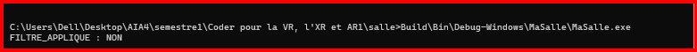
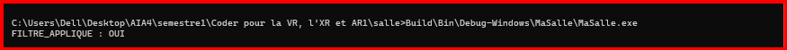

# Exercice6

## Objectif

Vérifier expérimentalement qu'un `filter` Jenga peut conditionner l'application d'une définition (`define`).

La vérification est effectuée directement par le programme, et non avec `jenga info`.

## Fichiers

* [Voir le fichier `salle.jenga`](salle.jenga)
* [Voir le fichier `main.cpp`](main.cpp)

## Test 1 — Condition fausse

Le filtre utilisé est :

```python
with filter("system:Linux"):
    defines(["FILTRE_APPLIQUE"])
```

La machine utilisée étant sous Windows, la condition est fausse.

### Sortie



La définition n'a donc pas été appliquée.

## Test 2 — Condition vraie

Le filtre est ensuite remplacé par :

```python
with filter("system:Windows"):
    defines(["FILTRE_APPLIQUE"])
```

La condition devient vraie sur la machine utilisée.

### Sortie



La définition a donc été appliquée.

## Conclusion

Les deux exécutions du programme permettent de prouver directement si le filtre a appliqué ou non la définition.

Le programme affiche :

* `FILTRE_APPLIQUE : NON` lorsque la condition est fausse ;
* `FILTRE_APPLIQUE : OUI` lorsque la condition est vraie.
