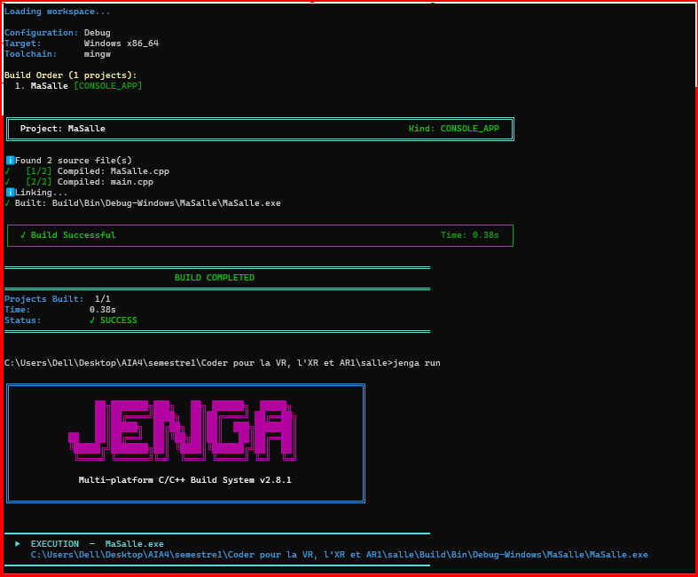

# Exercice8

## Objectif

Configurer des bibliothèques différentes selon le système d'exploitation avec les filtres Jenga.

## Configuration

```python
with filter("system:Windows"):
    links(["kernel32", "advapi32"])

with filter("system:Linux"):
    links(["m", "rt"])
```

## Résultat sous Windows

Le projet a été compilé et exécuté sous Windows avec succès.



La construction Windows est donc vérifiée.

## Résultat sous Linux

Le filtre Linux a été écrit dans le projet, mais sa construction n'a pas encore été vérifiée sur une machine Linux.

## Conclusion

Le projet est configuré pour sélectionner des bibliothèques différentes selon le système d'exploitation. La construction a été vérifiée sous Windows, tandis que la vérification sous Linux reste à effectuer.

