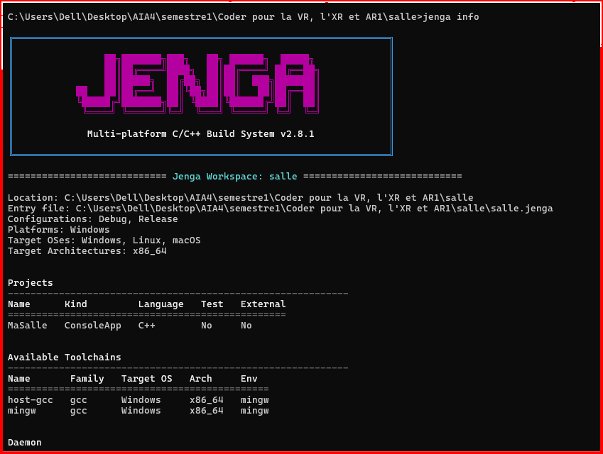
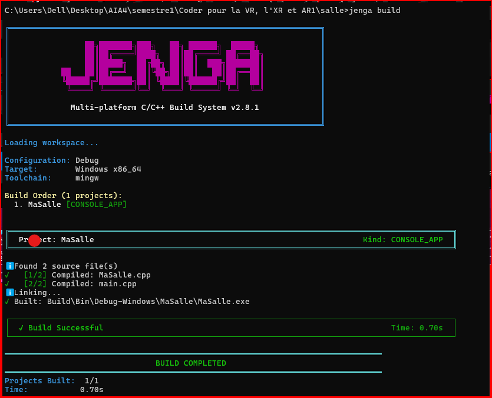

# Exercice9

## Objectif

Ajouter volontairement un motif de fichier inexistant et un répertoire inexistant afin de comparer les résultats de `jenga info` et `jenga build`.

## Modifications

Un fichier inexistant a été ajouté à `files` :

```python
"src/fichier_fake.cpp"
```

Un répertoire inexistant a été ajouté à `includedirs` :

```python
"dossier_fake"
```

## Résultat de `jenga info`

`jenga info` affiche les informations générales du workspace et du projet, mais ne signale pas les chemins inexistants.


## Résultat de `jenga build`

La construction réussit :


Le fichier inexistant n'est donc pas pris en compte et le dossier inexistant ne provoque pas d'erreur.

## Comparaison

Dans ce cas, ni `jenga info` ni `jenga build` ne signalent explicitement les chemins inexistants.

L'exercice montre donc qu'il faut être attentif aux motifs utilisés dans `files` et aux répertoires indiqués dans `includedirs`, car une construction réussie ne garantit pas que tous les chemins écrits dans le projet existent.

## Conclusion

La commande `jenga build` permet de vérifier que le projet se construit réellement, mais elle ne signale pas ici les chemins qui ne correspondent à aucun fichier ou répertoire.
