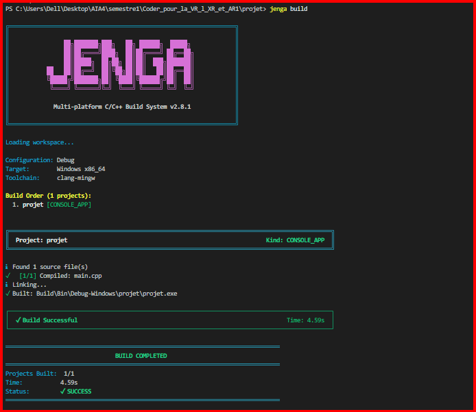
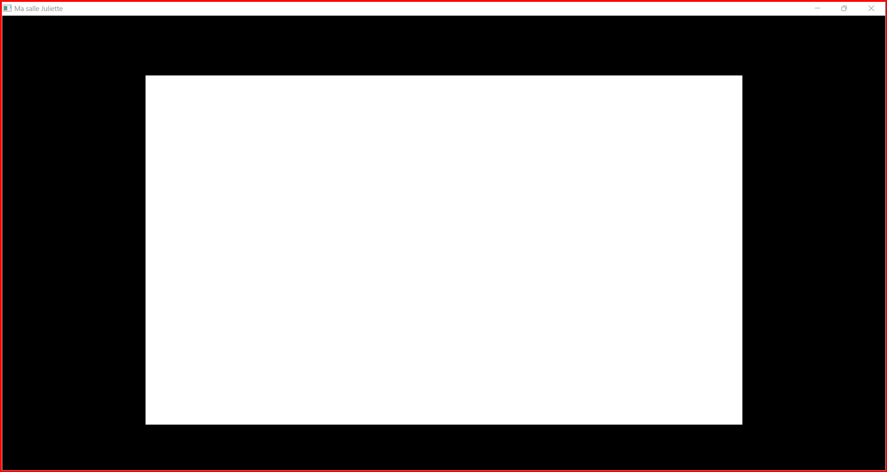

# Exercice 1 — La fenêtre nue

## Objectif

L'objectif de cet exercice est de créer une fenêtre simple avec **Nkentseu**, de configurer le projet avec **Jenga**, puis de construire et lancer l'application.

Cet exercice permet de vérifier que le workspace, le projet Jenga et le kit Nkentseu sont correctement configurés.

## Structure du projet

Le projet contient :

* un fichier de projet Jenga ;
* un fichier [`main.cpp`](src/main.cpp) contenant le programme principal ;
* le fichier de configuration [`MaFenetre.jenga`](MaFenetre.jenga) ;
* une capture de la fenêtre ;
* une capture de la sortie du terminal après la construction ;
* ce fichier `README.md`.

La structure du projet est la suivante :

```text
MaFenetreWks/
├── projet.jenga
├── src/
│   └── main.cpp
├── capture-fenetre.png
├── capture_terminal.png
└── README.md
```

## Programme C++

Le programme utilise **NkWindow** pour créer une fenêtre graphique.

```cpp
#include <NKWindow/NKWindow.h>
#include <NKEvent/NkEvent.h>
#include <NKWindow/NKMain.h>

int nkmain(const nkentseu::NkEntryState &state){
    nkentseu::NkWindowConfig config;

    config.title = "Ma salle Juliette";
    config.width = 1280;
    config.height = 720;

    nkentseu::NkWindow fenetre(config);

    if (!fenetre.IsValid()){
        return 1;
    }

    while (fenetre.IsOpen()){
        nkentseu::NkEvents().PollEvents();
    }

    return 0;
}
```

Le programme configure une fenêtre intitulée **« Ma salle Juliette »**, avec une largeur de **1200 pixels** et une hauteur de **720 pixels**.

La boucle `while` maintient la fenêtre ouverte tant que celle-ci est active. La fonction `PollEvents()` permet de traiter les événements de la fenêtre.

## Construction avec Jenga

Le projet est construit avec la commande :

```powershell
jenga build
```

La construction permet de compiler le fichier `main.cpp` et de produire l'application.

La sortie obtenue lors de la construction est fournie dans :



## Exécution

Après la construction, l'application est lancée afin de vérifier que la fenêtre est correctement créée.

La fenêtre obtenue est :



## Temps de réalisation

Le temps nécessaire à la réalisation de cet exercice a été de :

**03 jours**

Ce temps s'explique principalement par la configuration du projet et par la résolution des différentes erreurs rencontrées au cours de sa réalisation.